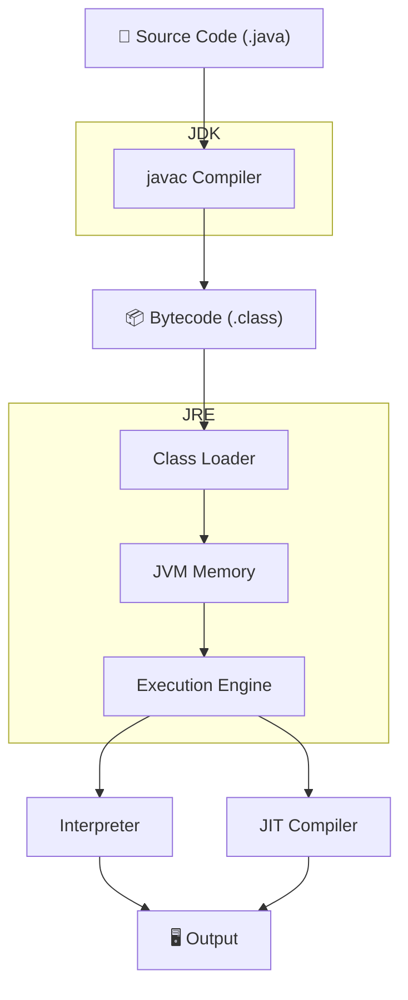
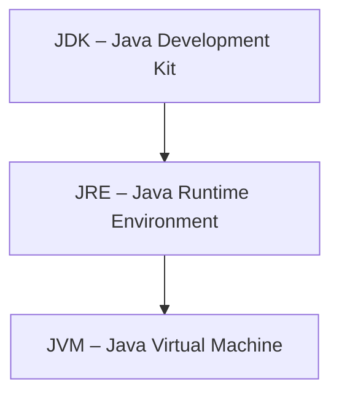
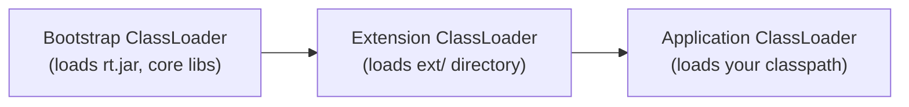
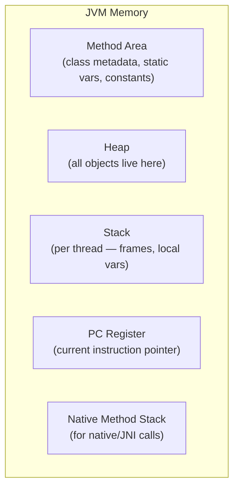
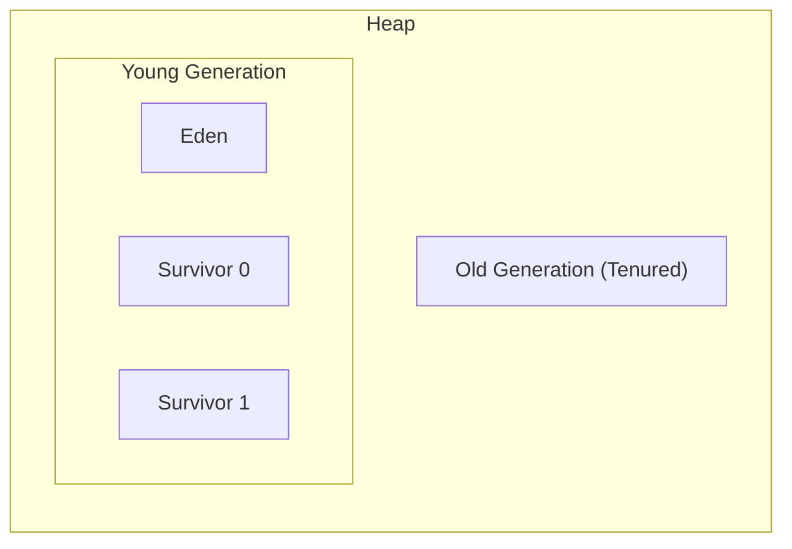
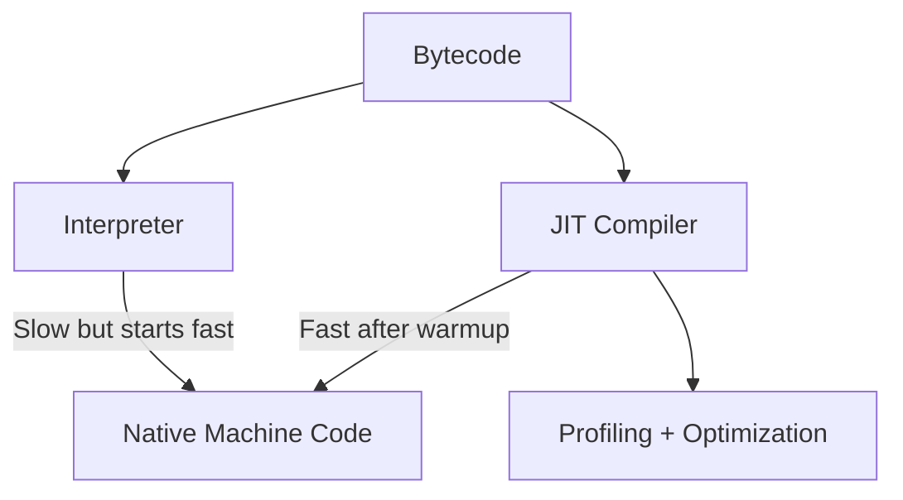
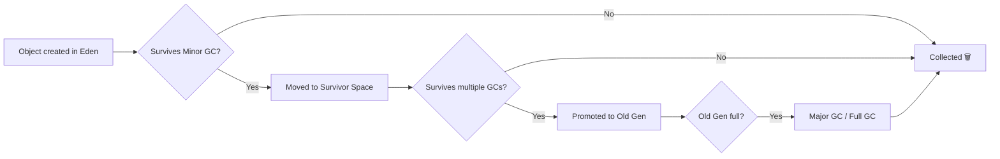
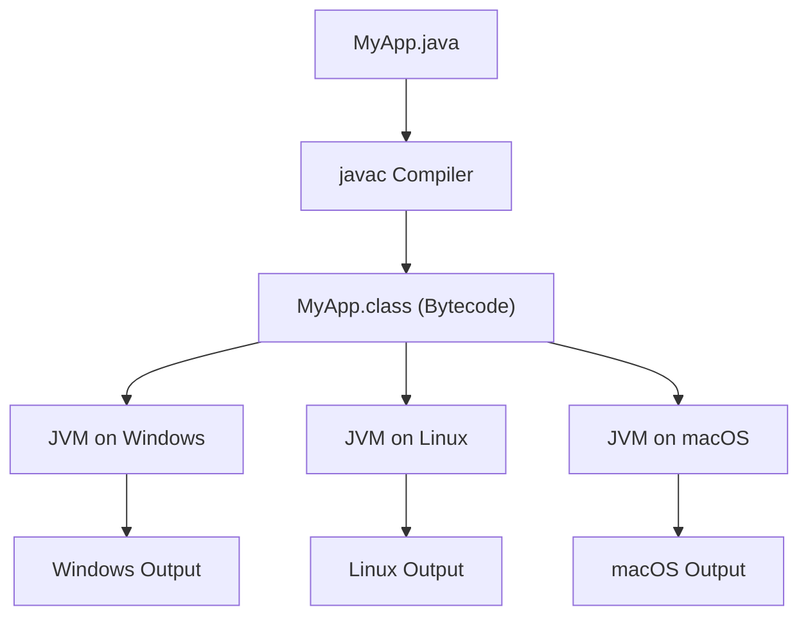
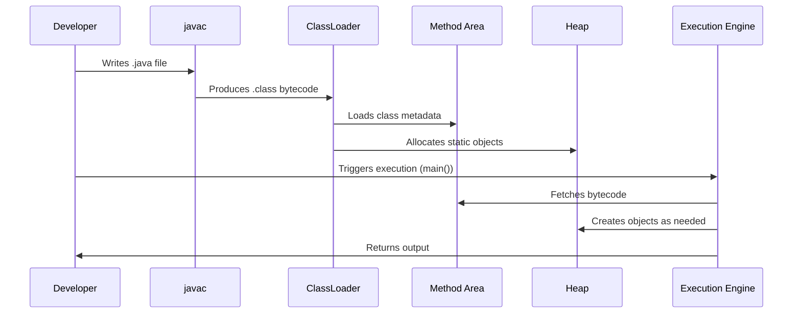

If you've been writing Java for a while, you've probably heard terms like JVM, JRE, JDK, bytecode, classloader thrown around. But how do these pieces actually fit together? What happens between the moment you hit *Run* and the moment your output appears?

This post walks through Java's architecture from top to bottom — the way it actually works, not just the textbook definitions.

---

## The Big Picture

Before getting into each component, here's how everything connects:



Java's *Write Once, Run Anywhere* promise is built on one key idea: your code doesn't compile to machine code directly — it compiles to **bytecode**, which the JVM then translates for whatever platform it's running on.

---

## JDK, JRE, JVM — What's the Difference?

These three are often confused. Here's a clean way to think about it:



| Component | What it is | Who needs it |
|-----------|------------|--------------|
| **JVM** | Executes bytecode | Everyone at runtime |
| **JRE** | JVM + standard libraries | Anyone running Java apps |
| **JDK** | JRE + compiler + dev tools | Developers |

So when you install the JDK, you're getting everything — the compiler (`javac`), the runtime (`JRE`), and the virtual machine (`JVM`). When you deploy to a server, usually only the JRE is needed.

---

## Step 1 — Compilation

You write `.java` files. The `javac` compiler reads them and produces `.class` files containing **bytecode**.
Bytecode isn't machine code. It's a platform-neutral instruction set that the JVM knows how to read. This is why the same `.class` file runs on Windows, Linux, or macOS without recompilation.

```text
MyApp.java  →  javac  →  MyApp.class
```

---
## Step 2 — Class Loading

Before the JVM can execute anything, it needs to load your `.class` files into memory. That's the **ClassLoader's** job.


The loading process follows three steps:

1. **Loading** — reads the `.class` file and brings it into memory
2. **Linking** — verifies bytecode, allocates memory for static variables, resolves symbolic references
3. **Initialization** — runs static initializers and assigns initial values to static fields

One important thing to know: classloaders follow the **parent delegation model**. Before loading a class, a classloader asks its parent first. This prevents you from accidentally overriding core Java classes.

---

## Step 3 — JVM Memory Areas

Once classes are loaded, the JVM organizes memory into distinct regions.


### Method Area

Stores class-level data — field and method info, the bytecode itself, static variables, and the runtime constant pool. In modern JVMs (Java 8+), this is called **Metaspace** and lives in native memory (not the heap).
- Shared by all threads
- Created once when JVM starts
- Contains Runtime Constant Pool

### Heap — Where Objects Live

The heap is shared across all threads. Every object you create with `new` ends up here.



- **Eden Space** — new objects are allocated here first
- **Survivor Spaces** — objects that survive a minor GC get moved here
- **Old Generation** — long-lived objects eventually get promoted here
- Managed automatically by Garbage Collector
- Memory leaks mainly occur here

### Stack — Where Method Calls Live

The Stack Area stores method execution information for each thread. Every method call creates a **stack frame** that holds local variables and references.
- Each thread has its own stack
- Stores local variables and method calls
- Memory is freed after method execution
- Faster than heap memory

### Program Counter Register (PC) — Current Instruction Pointer

The Program Counter Register keeps track of the current instruction being executed by a thread. It helps JVM resume execution after thread switching.

- One PC register per thread
- Stores address of current JVM instruction
- Undefined for native methods
- Supports thread scheduling

### Native Method Stack — For Native/JNI Calls

The Native Method Stack stores execution details of native methods written in languages like C or C++. It works alongside the Java Stack.
- Used for native (non-Java) methods
- Thread-specific memory area
- Depends on underlying OS
- Separate from Java Stack

---

## Step 4 — Execution Engine

This is where bytecode actually gets run. The execution engine has two ways to do it:



### Interpreter

Reads and executes bytecode instructions one at a time. It starts up fast but is slower in the long run because it re-interprets the same instructions every time they're hit.

### JIT Compiler (Just-In-Time)

The JVM monitors which code runs frequently — these are called **hot spots** (that's where HotSpot JVM gets its name). Hot code gets compiled to native machine code by the JIT compiler and cached. The next time that code runs, it executes at near-native speed.

This is why Java apps are slow to start but get faster as they warm up.

---

## Garbage Collection — Memory You Don't Have to Manage

Java handles memory deallocation automatically. The **Garbage Collector (GC)** periodically finds objects with no live references and reclaims their memory.



### Common GC Algorithms

| GC | Good for | Trade-off |
|----|----------|-----------|
| **Serial GC** | Single-threaded, small apps | Pauses everything |
| **Parallel GC** | Throughput-focused | Still causes pauses |
| **G1 GC** | Balanced, default since Java 9 | Predictable pause times |
| **ZGC / Shenandoah** | Low-latency apps | Higher CPU usage |

You can configure GC with JVM flags:

```bash
# Use G1 GC
java -XX:+UseG1GC -jar myapp.jar

# Use ZGC (Java 15+)
java -XX:+UseZGC -jar myapp.jar
```

---

## Java's Platform Independence — How It Actually Works



The bytecode is identical across platforms. Each platform just needs its own JVM implementation that knows how to translate that bytecode into the right native instructions.

---

## Putting It All Together

Here's the full end-to-end flow one more time, now with everything in context:



---

## Quick Reference — Key Terms

| Term | What it means |
|------|---------------|
| **Bytecode** | Platform-neutral compiled output of `javac` |
| **JVM** | Executes bytecode; platform-specific |
| **JRE** | JVM + standard libraries |
| **JDK** | JRE + dev tools (compiler, debugger, etc.) |
| **ClassLoader** | Loads `.class` files into JVM memory |
| **Heap** | Shared memory for all objects |
| **Stack** | Per-thread memory for method calls |
| **Metaspace** | Stores class metadata (Java 8+, native memory) |
| **JIT Compiler** | Compiles hot bytecode to native code at runtime |
| **GC** | Automatically reclaims memory from dead objects |

---

## Conclusion

Java's architecture is what makes it both portable and performant. The JVM does a lot of heavy lifting behind the scenes — classloading, memory management, JIT optimization, garbage collection — so you can focus on writing clean application code.

Understanding this flow is genuinely useful beyond just interviews. When your app is slow to start, you know it's JIT warmup. When you're tuning memory, you know which heap region to look at. When you hit a `ClassNotFoundException`, you know exactly which layer broke.

---