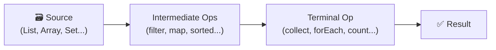

If you've been writing Java for a while, you've probably typed `.stream()` at some point — maybe to filter a list, transform values, or collect results. But do you know what's actually happening behind the scenes? What makes streams "lazy"? When do they actually execute? And why do you sometimes need `flatMap` instead of `map`?

This guide walks through Java Streams from scratch — building up from the core idea all the way through collectors, parallel streams, and real-world use cases. Every operation comes with code **and** its output together, so you can follow along without guessing what happens.

---

## What Is a Java Stream?

A Java Stream is **not** a data structure. It doesn't store data. Think of it as a pipeline — you plug in a data source, describe what you want to do with the data, and a result comes out the other end.



Streams support **declarative programming** — you describe *what* you want, not *how* to do it step by step. Compare these two approaches to the same problem:

```java
// Traditional for-loop (imperative — describes HOW)
List<String> result = new ArrayList<>();
for (String name : names) {
    if (name.startsWith("A")) {
        result.add(name.toUpperCase());
    }
}

// Stream (declarative — describes WHAT)
List<String> result = names.stream()
    .filter(name -> name.startsWith("A"))
    .map(String::toUpperCase)
    .collect(Collectors.toList());
```

Both do the same thing. The stream version reads like a sentence.

---

## The Three Parts of Every Stream

Before writing any stream code, understand this mental model:

| Part | What it is | Examples |
|------|------------|---------|
| **Source** | Where the data comes from | `List`, `Array`, `Set` |
| **Intermediate Operations** | Transform the stream; *lazy* — not executed until a terminal op is called | `filter`, `map`, `sorted`, `distinct` |
| **Terminal Operation** | Triggers execution and produces a result | `collect`, `forEach`, `reduce`, `count` |

> **Key rule:** Nothing happens until a terminal operation is called. Intermediate operations just build up the pipeline description.

---

## Creating Streams

There are several ways to get a stream. Here are the most common ones — each shown with its output:

```java
// 1. From a List (most common)
List<String> list = List.of("one", "two", "three");
list.stream().forEach(System.out::println);
// Output:
// one
// two
// three

// 2. From an Array
String[] array = {"alpha", "beta", "gamma"};
Arrays.stream(array).forEach(System.out::println);
// Output:
// alpha
// beta
// gamma

// 3. Stream.of() — from individual elements
Stream.of("x", "y", "z").forEach(System.out::println);
// Output:
// x
// y
// z

// 4. Primitive streams — IntStream, LongStream, DoubleStream
IntStream.range(1, 5).forEach(System.out::println);
// Output:
// 1
// 2
// 3
// 4

// 5. Stream.builder()
Stream<String> stream = Stream.<String>builder()
    .add("a")
    .add("b")
    .add("c")
    .build();
stream.forEach(System.out::println);
// Output:
// a
// b
// c
```

---

## Intermediate Operations

Intermediate operations are the transformation steps inside a pipeline. They are **lazy** — they don't run until a terminal operation is called. You can chain as many as you need.

Let's first see all the major intermediate operations chained in one example, then break each one down individually.

### The Big Picture — All Operations in One Pipeline

```java
List<String> list = Arrays.asList("apple", "banana", "cherry", "apple", "banana", "date");

List<String> result = list.stream()
    .filter(s -> s.startsWith("a"))         // keep only strings starting with 'a'
    .map(String::toUpperCase)               // convert to uppercase
    .flatMap(s -> Stream.of(s.split("")))   // split each string into individual characters
    .distinct()                             // remove duplicates
    .sorted()                               // sort alphabetically
    .limit(10)                              // cap at 10 elements
    .skip(1)                                // skip the first element
    .peek(System.out::println)              // print each element as it passes through
    .collect(Collectors.toList());          // collect into a List

System.out.println("Result: " + result);

// Step-by-step breakdown:
// Initial list                             → ["apple", "banana", "cherry", "apple", "banana", "date"]
// filter(s -> s.startsWith("a"))           → ["apple", "apple"]
// map(String::toUpperCase)                 → ["APPLE", "APPLE"]
// flatMap(s -> Stream.of(s.split("")))     → ["A","P","P","L","E","A","P","P","L","E"]
// distinct()                               → ["A", "P", "L", "E"]
// sorted()                                 → ["A", "E", "L", "P"]
// limit(10)                                → ["A", "E", "L", "P"]  (already 4, no effect)
// skip(1)                                  → ["E", "L", "P"]
// peek(System.out::println)               → prints E, L, P
// collect(Collectors.toList())             → ["E", "L", "P"]

// Output:
// E
// L
// P
// Result: [E, L, P]
```

Now let's go through each operation on its own.

---

### `filter` — Keep What Matches

Keeps only elements that pass a given condition (predicate).

```java
List<String> names = Arrays.asList("Alice", "Bob", "Anna", "Charlie");

List<String> result = names.stream()
    .filter(name -> name.startsWith("A"))
    .collect(Collectors.toList());

System.out.println(result);
// Output: [Alice, Anna]
```

---

### `map` — Transform Each Element (One-to-One)

Applies a function to every element and produces a new stream with the results.

```java
List<String> names = Arrays.asList("Alice", "Bob", "Charlie");

List<String> upperNames = names.stream()
    .map(String::toUpperCase)
    .collect(Collectors.toList());

System.out.println(upperNames);
// Output: [ALICE, BOB, CHARLIE]
```

Each input element produces exactly **one** output element.

---

### `flatMap` — Flatten Nested Structures (One-to-Many)

When each element maps to a *collection* or stream, `flatMap` flattens all of them into a single stream.

```java
List<List<Integer>> nestedLists = Arrays.asList(
    Arrays.asList(1, 2),
    Arrays.asList(3, 4, 5),
    Arrays.asList(6)
);

List<Integer> flatList = nestedLists.stream()
    .flatMap(List::stream)
    .collect(Collectors.toList());

System.out.println(flatList);
// Output: [1, 2, 3, 4, 5, 6]
```

**Real-world analogy:**
- `map` → peeling individual apples. One apple in, one peeled apple out.
- `flatMap` → emptying bags of apples into one pile. One bag in, many apples out.

**When to use which:**

| Use `map` when... | Use `flatMap` when... |
|---|---|
| Each element transforms to one result | Each element produces multiple results |
| Working with simple value transformations | Working with nested collections |

---

### `distinct` — Remove Duplicates

```java
List<Integer> numbers = Arrays.asList(1, 2, 2, 3, 3, 3, 4);

List<Integer> unique = numbers.stream()
    .distinct()
    .collect(Collectors.toList());

System.out.println(unique);
// Output: [1, 2, 3, 4]
```

Uses `equals()` internally to decide what counts as a duplicate.

---

### `sorted` — Sort Elements

```java
List<String> names = Arrays.asList("Charlie", "Alice", "Bob");

// Natural order
List<String> sorted = names.stream()
    .sorted()
    .collect(Collectors.toList());
System.out.println(sorted);
// Output: [Alice, Bob, Charlie]

// Custom comparator — sort by string length
List<String> byLength = names.stream()
    .sorted(Comparator.comparing(String::length))
    .collect(Collectors.toList());
System.out.println(byLength);
// Output: [Bob, Alice, Charlie]
```

> `sorted()` is **not** short-circuiting — it must process every element before it can return the first result.

---

### `limit` and `skip` — Control Stream Size

```java
List<Integer> numbers = Arrays.asList(1, 2, 3, 4, 5, 6, 7, 8, 9, 10);

// limit: take only the first N elements
List<Integer> first5 = numbers.stream()
    .limit(5)
    .collect(Collectors.toList());
System.out.println(first5);
// Output: [1, 2, 3, 4, 5]

// skip: discard the first N elements
List<Integer> after3 = numbers.stream()
    .skip(3)
    .collect(Collectors.toList());
System.out.println(after3);
// Output: [4, 5, 6, 7, 8, 9, 10]

// Combine both — useful for pagination
List<Integer> page2 = numbers.stream()
    .skip(3)   // skip page 1
    .limit(3)  // take page 2
    .collect(Collectors.toList());
System.out.println(page2);
// Output: [4, 5, 6]
```

---

### `peek` — Debug Mid-Pipeline

An intermediate operation that lets you inspect elements without modifying or consuming them. Mostly useful for debugging.

```java
List<String> result = Arrays.asList("apple", "banana", "cherry").stream()
    .filter(s -> s.length() > 5)
    .peek(s -> System.out.println("After filter: " + s))
    .map(String::toUpperCase)
    .peek(s -> System.out.println("After map:    " + s))
    .collect(Collectors.toList());

// Output:
// After filter: banana
// After map:    BANANA
// After filter: cherry
// After map:    CHERRY
```

---

## Terminal Operations

Terminal operations **trigger the entire pipeline** and produce a final result. Once called, the stream is consumed — you cannot reuse it.

---

### `forEach` — Iterate Over Elements

```java
List<String> names = Arrays.asList("Alice", "Bob", "Charlie");

names.stream().forEach(System.out::println);
// Output:
// Alice
// Bob
// Charlie
```

---

### `collect` — Gather Into a Collection

The most versatile terminal operation. Works with `Collectors` to produce lists, sets, maps, strings, and more.

```java
List<String> names = Arrays.asList("Alice", "Bob", "Charlie", "Alice");

// Collect to List (preserves order and duplicates)
List<String> list = names.stream().collect(Collectors.toList());
System.out.println(list);
// Output: [Alice, Bob, Charlie, Alice]

// Collect to Set (removes duplicates, order not guaranteed)
Set<String> set = names.stream().collect(Collectors.toSet());
System.out.println(set);
// Output: [Alice, Bob, Charlie]

// Join into a single String
String joined = names.stream().collect(Collectors.joining(", "));
System.out.println(joined);
// Output: Alice, Bob, Charlie, Alice
```

---

### `count` — Count Elements

```java
List<String> names = Arrays.asList("Alice", "Bob", "Anna", "Charlie");

long count = names.stream()
    .filter(name -> name.startsWith("A"))
    .count();

System.out.println(count);
// Output: 2
```

---

### `reduce` — Combine Into One Value

Repeatedly applies a combining function to collapse all elements into a single result.

```java
List<Integer> numbers = Arrays.asList(1, 2, 3, 4, 5);

// Sum using reduce
int sum = numbers.stream()
    .reduce(0, Integer::sum);
System.out.println(sum);
// Output: 15

// Product using a lambda
int product = numbers.stream()
    .reduce(1, (a, b) -> a * b);
System.out.println(product);
// Output: 120
```

The first argument (`0` or `1`) is the **identity** — the starting value before any elements are processed.

---

### `min` and `max` — Find Extremes

```java
List<Integer> numbers = Arrays.asList(3, 1, 4, 1, 5, 9, 2, 6);

Optional<Integer> min = numbers.stream().min(Comparator.naturalOrder());
Optional<Integer> max = numbers.stream().max(Comparator.naturalOrder());

System.out.println("Min: " + min.get()); // Output: Min: 1
System.out.println("Max: " + max.get()); // Output: Max: 9
```

Both return `Optional` because the stream could be empty.

---

### `anyMatch`, `allMatch`, `noneMatch` — Check Conditions

These are **short-circuiting** — they stop processing as soon as the answer is determined.

```java
List<Integer> numbers = Arrays.asList(2, 4, 5, 6, 8);

boolean anyOdd  = numbers.stream().anyMatch(n -> n % 2 != 0);
boolean allEven = numbers.stream().allMatch(n -> n % 2 == 0);
boolean noneNeg = numbers.stream().noneMatch(n -> n < 0);

System.out.println("Any odd?  " + anyOdd);   // Output: Any odd?  true
System.out.println("All even? " + allEven);  // Output: All even? false
System.out.println("None neg? " + noneNeg);  // Output: None neg? true
```

---

### `findFirst` and `findAny` — Pick an Element

```java
List<String> names = Arrays.asList("Alice", "Bob", "Anna", "Charlie");

Optional<String> first = names.stream()
    .filter(name -> name.startsWith("A"))
    .findFirst();

System.out.println(first.orElse("Not found"));
// Output: Alice
```

`findFirst()` returns the first match in encounter order. `findAny()` may return any match — designed for parallel streams where order doesn't matter.

---

## Collectors in Depth

Beyond the basics, `Collectors` provides some powerful grouping and statistical operations.

### `groupingBy` — Group Elements Into a Map

```java
List<String> words = Arrays.asList("cat", "dog", "cow", "deer", "duck");

Map<Integer, List<String>> byLength = words.stream()
    .collect(Collectors.groupingBy(String::length));

System.out.println(byLength);
// Output: {3=[cat, dog, cow], 4=[deer, duck]}
```

### `partitioningBy` — Split Into Two Groups

Like `groupingBy` but the key is always `true` or `false`.

```java
List<Integer> numbers = Arrays.asList(1, 2, 3, 4, 5, 6, 7, 8);

Map<Boolean, List<Integer>> evenOdd = numbers.stream()
    .collect(Collectors.partitioningBy(n -> n % 2 == 0));

System.out.println("Even: " + evenOdd.get(true));
System.out.println("Odd:  " + evenOdd.get(false));
// Output:
// Even: [2, 4, 6, 8]
// Odd:  [1, 3, 5, 7]
```

### `summarizingDouble` — Get Stats in One Pass

```java
List<Double> salaries = Arrays.asList(100000.0, 200000.0, 300000.0);

DoubleSummaryStatistics stats = salaries.stream()
    .collect(Collectors.summarizingDouble(Double::doubleValue));

System.out.println("Count:   " + stats.getCount());    // Count:   3
System.out.println("Sum:     " + stats.getSum());      // Sum:     600000.0
System.out.println("Min:     " + stats.getMin());      // Min:     100000.0
System.out.println("Max:     " + stats.getMax());      // Max:     300000.0
System.out.println("Average: " + stats.getAverage());  // Average: 200000.0
```

---

## Primitive Streams — Avoid Boxing Overhead

For numeric work, Java provides `IntStream`, `LongStream`, and `DoubleStream`. These avoid boxing `int` into `Integer` for every element, which matters for performance at scale.

```java
// Sum using IntStream
int sum = IntStream.rangeClosed(1, 10).sum();
System.out.println(sum);
// Output: 55

// Average using DoubleStream
OptionalDouble avg = DoubleStream.of(10.5, 20.5, 30.0).average();
System.out.println(avg.getAsDouble());
// Output: 20.333...

// Convert an object stream → IntStream
List<String> words = Arrays.asList("hello", "world", "java");
int totalChars = words.stream()
    .mapToInt(String::length)
    .sum();
System.out.println(totalChars);
// Output: 15
```

> `Stream.of(1, 2, 3)` returns `Stream<Integer>` — **not** `IntStream`. Use `mapToInt()` explicitly when you need a primitive stream.

---

## Infinite Streams

Java supports unbounded streams — useful when you don't know the size upfront. Always pair them with a terminating operation like `limit()`.

### `Stream.generate()` — Supply Elements on Demand

```java
Stream.generate(Math::random)
    .limit(3)
    .forEach(System.out::println);
// Output (3 random doubles):
// 0.7340783...
// 0.1234567...
// 0.9876543...
```

### `Stream.iterate()` — Compute Next From Previous

```java
List<Integer> powers = Stream.iterate(2, i -> i * 2)
    .limit(6)
    .collect(Collectors.toList());

System.out.println(powers);
// Output: [2, 4, 8, 16, 32, 64]
```

---

## Parallel Streams

Parallel streams split the workload across multiple CPU cores. The switch is trivial — just replace `.stream()` with `.parallelStream()`.

```java
List<String> myList = Arrays.asList("a", "b", "c", "d", "e");

// Sequential — order guaranteed
myList.stream().forEach(System.out::print);
// Output: abcde

System.out.println();

// Parallel — order NOT guaranteed
myList.parallelStream().forEach(System.out::print);
// Output (example — varies per run): caebd

// You can also convert an existing stream to parallel
myList.stream().parallel().forEach(System.out::print);
```

**Use parallel streams when:**
- You have a large dataset (thousands+ of elements)
- Operations are independent of each other
- Operations are CPU-bound and computationally expensive

**Avoid parallel streams when:**
- The dataset is small — thread management overhead will negate any gain
- Operations involve I/O — I/O is the bottleneck, not CPU
- Order of results matters
- Operations share mutable state — concurrent modifications cause bugs

---

## Real-World Use Cases

Here's where streams shine in actual application code.

### Filtering and Transforming Data

Getting names of all high-earning employees:

```java
List<Employee> employees = getEmployees();

List<String> highEarners = employees.stream()
    .filter(e -> e.getSalary() > 50000)
    .map(Employee::getName)
    .sorted()
    .collect(Collectors.toList());

System.out.println(highEarners);
// Output: [Alice, Charlie, Mark]
```

### Aggregating Data

Calculating total sales from a list of transactions:

```java
List<Transaction> transactions = getTransactions();

double totalSales = transactions.stream()
    .mapToDouble(Transaction::getAmount)
    .sum();

System.out.println("Total Sales: " + totalSales);
// Output: Total Sales: 148500.0
```

### Grouping and Partitioning

Grouping students by their grade:

```java
List<Student> students = getStudents();

Map<Grade, List<Student>> studentsByGrade = students.stream()
    .collect(Collectors.groupingBy(Student::getGrade));

studentsByGrade.forEach((grade, s) ->
    System.out.println(grade + ": " + s.size() + " students")
);
// Output:
// A: 5 students
// B: 8 students
// C: 3 students
```

### Parallel Processing on Large Datasets

Finding all prime numbers up to 1,000,000:

```java
long range = 1_000_000;

List<Long> primes = LongStream.rangeClosed(2, range)
    .parallel()
    .filter(n -> isPrime(n))
    .boxed()
    .collect(Collectors.toList());

System.out.println("Total primes found: " + primes.size());
// Output: Total primes found: 78498
```

---

## Quick Reference

| Operation | Type | Short-circuits? | Returns |
|-----------|------|----------------|---------|
| `filter` | Intermediate | No | `Stream<T>` |
| `map` | Intermediate | No | `Stream<R>` |
| `flatMap` | Intermediate | No | `Stream<R>` |
| `distinct` | Intermediate | No | `Stream<T>` |
| `sorted` | Intermediate | No | `Stream<T>` |
| `limit` | Intermediate | Yes | `Stream<T>` |
| `skip` | Intermediate | No | `Stream<T>` |
| `peek` | Intermediate | No | `Stream<T>` |
| `collect` | Terminal | No | Collection / value |
| `forEach` | Terminal | No | `void` |
| `reduce` | Terminal | No | `Optional<T>` or `T` |
| `count` | Terminal | No | `long` |
| `min` / `max` | Terminal | No | `Optional<T>` |
| `anyMatch` | Terminal | Yes | `boolean` |
| `allMatch` | Terminal | Yes | `boolean` |
| `noneMatch` | Terminal | Yes | `boolean` |
| `findFirst` | Terminal | Yes | `Optional<T>` |
| `findAny` | Terminal | Yes | `Optional<T>` |

---

## Key Takeaways

- **Streams are not data structures** — they wrap a source and describe a processing pipeline.
- **Intermediate operations are lazy** — nothing runs until a terminal operation is called.
- **Terminal operations consume the stream** — you can't reuse it after that.
- **`map` is one-to-one, `flatMap` is one-to-many** — use `flatMap` when each element produces a collection.
- **Prefer primitive streams** (`IntStream`, `LongStream`, `DoubleStream`) for numeric work to avoid boxing overhead.
- **Parallel streams aren't always faster** — small datasets + overhead = slower. Profile before switching.
- **`sorted()` is not short-circuiting** — it reads the entire stream before returning anything.

Happy Streaming! 🚀

---