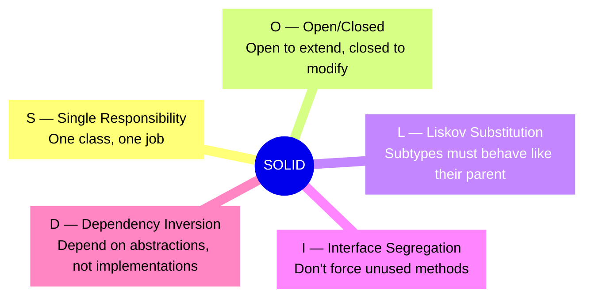
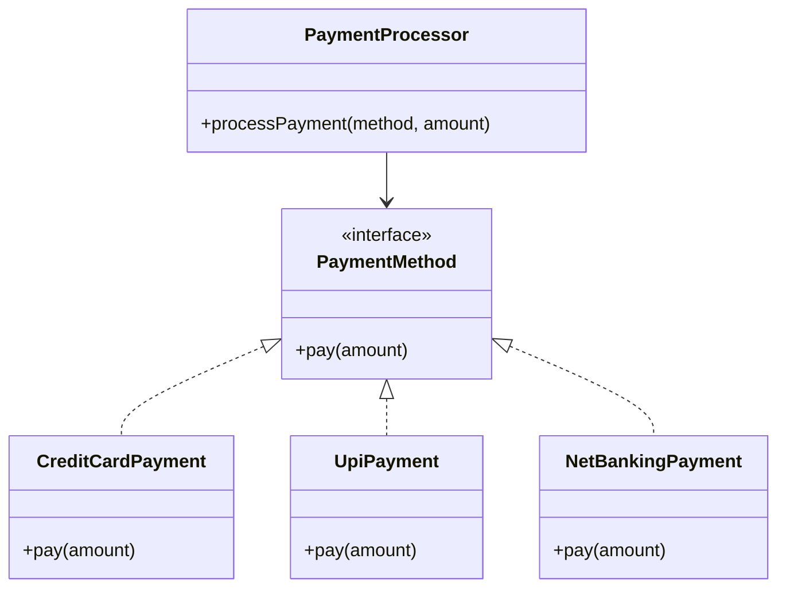
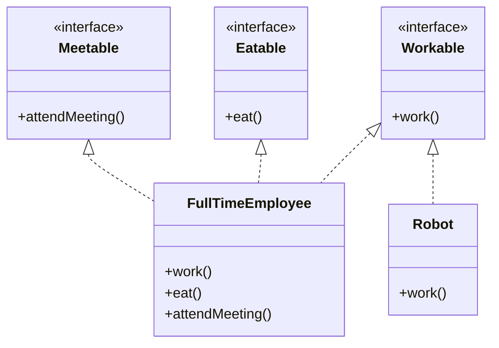
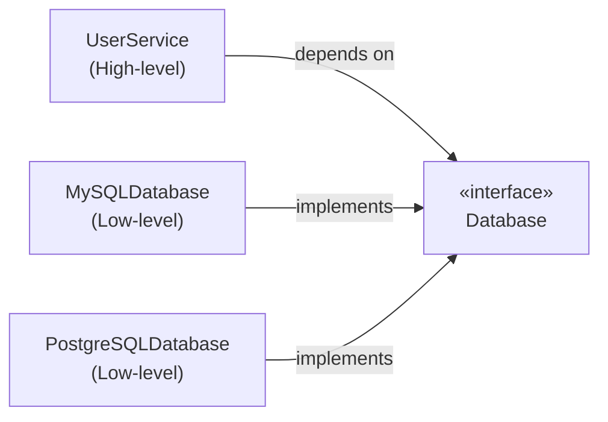

Let me paint a picture you might recognize.

You join a project. The code "works." But every time you need to add a feature, you end up touching five different files, breaking two things that had nothing to do with what you changed, and spending 40 minutes tracking down why a `NullPointerException` appeared in a class that doesn't even seem related.

That's what happens when SOLID principles get ignored.

**SOLID** isn't a framework or a library — it's a set of five design principles that, when followed, make your code easier to understand, extend, and maintain. Coined by Robert C. Martin (Uncle Bob), these principles have stood the test of time for a reason.

Let's go through all five with real Java examples.

---

## The Five Principles at a Glance



---

## S — Single Responsibility Principle

> *A class should have one, and only one, reason to change.*

This is the most intuitive principle — and also the most commonly violated one.

### The Problem

Imagine you're building an invoice system. A junior dev (or a rushed senior dev, no judgment) writes this:

```java
public class Invoice {

    private String customerName;
    private List<String> items;
    private double totalAmount;

    public double calculateTotal() {
        // calculate total logic
        return totalAmount;
    }

    public void printInvoice() {
        // prints to console
        System.out.println("Invoice for: " + customerName);
    }

    public void saveToDatabase() {
        // JDBC logic to save invoice
        System.out.println("Saving invoice to DB...");
    }
}
```

Looks fine at first glance. But this one class is doing **three completely different jobs**:
- Business logic (calculating totals)
- Presentation logic (printing)
- Persistence logic (saving to DB)

If the print format changes, you touch this class. If the database schema changes, you touch this class. If the calculation logic changes, you touch this class again. Three reasons to change = three headaches waiting to happen.

### The Fix

Split responsibilities into focused classes:

```java
// Handles only business logic
public class Invoice {
    private String customerName;
    private List<String> items;
    private double totalAmount;

    public double calculateTotal() {
        return totalAmount;
    }
}

// Handles only printing
public class InvoicePrinter {
    public void print(Invoice invoice) {
        System.out.println("Invoice for: " + invoice.getCustomerName());
    }
}

// Handles only persistence
public class InvoiceRepository {
    public void save(Invoice invoice) {
        // JDBC logic here
        System.out.println("Saving invoice to DB...");
    }
}
```

Now each class has **one reason to change**. If the DB layer switches from JDBC to JPA, only `InvoiceRepository` changes. The rest of your code doesn't even notice.

---

## O — Open/Closed Principle

> *A class should be open for extension but closed for modification.*

In other words: you should be able to add new behavior **without touching existing, working code**.

### The Problem

You're building a payment service. You start simple:

```java
public class PaymentProcessor {

    public void processPayment(String paymentType, double amount) {
        if (paymentType.equals("CREDIT_CARD")) {
            System.out.println("Processing credit card payment of ₹" + amount);
        } else if (paymentType.equals("UPI")) {
            System.out.println("Processing UPI payment of ₹" + amount);
        }
        // Next sprint: add NETBANKING, WALLET, CRYPTO...
        // This if-else block grows forever
    }
}
```

Every new payment method means modifying this class. You're one bad merge away from breaking credit card payments while adding UPI support. That's a production incident waiting to happen.

### The Fix

Define an abstraction and let each payment type implement it:

```java
// The abstraction
public interface PaymentMethod {
    void pay(double amount);
}

// Each type is its own class
public class CreditCardPayment implements PaymentMethod {
    @Override
    public void pay(double amount) {
        System.out.println("Processing credit card payment of ₹" + amount);
    }
}

public class UpiPayment implements PaymentMethod {
    @Override
    public void pay(double amount) {
        System.out.println("Processing UPI payment of ₹" + amount);
    }
}

// The processor is closed for modification, open for extension
public class PaymentProcessor {
    public void processPayment(PaymentMethod method, double amount) {
        method.pay(amount);
    }
}
```

Now adding NetBanking support means writing a new class `NetBankingPayment implements PaymentMethod` — and **not touching anything else**. The existing processor just works.



---

## L — Liskov Substitution Principle

> *Subclasses should be substitutable for their base classes without breaking the application.*

This one has a fancy name but a simple idea: if you have a method that accepts a `Bird`, it shouldn't blow up when you pass in a `Penguin`.

### The Problem

Classic example — the bird hierarchy:

```java
public class Bird {
    public void fly() {
        System.out.println("Flying...");
    }
}

public class Penguin extends Bird {
    @Override
    public void fly() {
        // Penguins can't fly!
        throw new UnsupportedOperationException("Penguins don't fly!");
    }
}

// Somewhere in your code...
public void makeBirdFly(Bird bird) {
    bird.fly(); // 💥 Blows up if you pass a Penguin
}
```

`Penguin` is a `Bird`, but substituting it breaks the program. LSP violation.

### The Fix

Restructure the hierarchy to reflect reality:

```java
// Base class only has what ALL birds share
public abstract class Bird {
    public abstract void move();
}

// Birds that fly
public abstract class FlyingBird extends Bird {
    public void fly() {
        System.out.println("Flying...");
    }

    @Override
    public void move() {
        fly();
    }
}

// Birds that swim
public class Penguin extends Bird {
    @Override
    public void move() {
        System.out.println("Swimming...");
    }
}

public class Eagle extends FlyingBird {
    // Inherits fly() naturally
}
```

Now `makeBirdFly(Bird bird)` can safely be rewritten to `makeMove(Bird bird)` — and every subclass works correctly. No surprises.

---

## I — Interface Segregation Principle

> *Clients should not be forced to implement interfaces they don't use.*

Fat interfaces are a smell. If you're writing `throw new UnsupportedOperationException()` in a method you were *forced* to implement, ISP has already been violated.

### The Problem

You build a `Worker` interface for an HR system:

```java
public interface Worker {
    void work();
    void eat();
    void attendMeeting();
}

// Full-time employees — all methods make sense
public class FullTimeEmployee implements Worker {
    public void work() { System.out.println("Working..."); }
    public void eat() { System.out.println("Eating lunch..."); }
    public void attendMeeting() { System.out.println("In a meeting..."); }
}

// Robots can work but don't eat or attend meetings
public class Robot implements Worker {
    public void work() { System.out.println("Beep boop, working..."); }
    public void eat() { throw new UnsupportedOperationException("Robots don't eat!"); }
    public void attendMeeting() { throw new UnsupportedOperationException("Robots don't have meetings!"); }
}
```

Poor `Robot` is forced to implement behavior it has no business having.

### The Fix

Break the fat interface into smaller, focused ones:

```java
public interface Workable {
    void work();
}

public interface Eatable {
    void eat();
}

public interface Meetable {
    void attendMeeting();
}

// Employees implement what makes sense
public class FullTimeEmployee implements Workable, Eatable, Meetable {
    public void work() { System.out.println("Working..."); }
    public void eat() { System.out.println("Eating lunch..."); }
    public void attendMeeting() { System.out.println("In a meeting..."); }
}

// Robots only implement what they actually do
public class Robot implements Workable {
    public void work() { System.out.println("Beep boop, working..."); }
}
```

Clean. No fake implementations, no runtime bombs.



---

## D — Dependency Inversion Principle

> *High-level modules should not depend on low-level modules. Both should depend on abstractions.*

This is the one that unlocks proper testability and flexibility. If your service class has `new MySQLDatabase()` hardcoded inside it, swapping databases means rewriting the service. That's a DIP violation.

### The Problem

```java
public class MySQLDatabase {
    public void save(String data) {
        System.out.println("Saving to MySQL: " + data);
    }
}

public class UserService {
    // High-level module directly depends on a low-level detail
    private MySQLDatabase database = new MySQLDatabase();

    public void saveUser(String userData) {
        database.save(userData);
    }
}
```

`UserService` is glued to MySQL. Want to switch to PostgreSQL for tests? Or use an in-memory store? You'd have to modify `UserService` directly. That's painful.

### The Fix

Introduce an abstraction between them:

```java
// The abstraction — neither side knows about the other's internals
public interface Database {
    void save(String data);
}

// Low-level detail implements the abstraction
public class MySQLDatabase implements Database {
    @Override
    public void save(String data) {
        System.out.println("Saving to MySQL: " + data);
    }
}

public class PostgreSQLDatabase implements Database {
    @Override
    public void save(String data) {
        System.out.println("Saving to PostgreSQL: " + data);
    }
}

// High-level module depends only on the abstraction
public class UserService {
    private final Database database;

    // Injected from outside — Spring does this beautifully
    public UserService(Database database) {
        this.database = database;
    }

    public void saveUser(String userData) {
        database.save(userData);
    }
}
```

And wiring it up (without Spring, to keep it clear):

```java
// In production
Database db = new MySQLDatabase();
UserService service = new UserService(db);

// In tests
Database testDb = new InMemoryDatabase(); // mock or stub
UserService testService = new UserService(testDb);
```

`UserService` doesn't care which database it's talking to. It just calls `.save()` on whatever it's handed. This is exactly what Spring's `@Autowired` and dependency injection containers do under the hood.



---

## Quick Reference

| Principle | One-liner | Symptom of violation |
|-----------|-----------|----------------------|
| **S**ingle Responsibility | One class, one job | Class changes for multiple reasons |
| **O**pen/Closed | Extend without modifying | Giant `if-else` chains per new type |
| **L**iskov Substitution | Subclasses honor parent's contract | `UnsupportedOperationException` in overrides |
| **I**nterface Segregation | Lean, focused interfaces | Dummy method implementations |
| **D**ependency Inversion | Depend on abstractions | `new ConcreteClass()` deep inside services |

---

## Final Thoughts

SOLID principles aren't rules you follow to pass a code review. They're guidelines that emerge from real pain — the kind of pain you feel when you touch a 2000-line God class or when adding one feature breaks three unrelated things.

You don't need to apply all five perfectly from day one. Start with **SRP** — just ask "how many reasons does this class have to change?" — and you'll naturally drift toward cleaner code.

The best part? When your interviewer asks about SOLID (and they will), you won't just recite definitions. You'll have actual examples to talk through. That's the kind of answer that sticks.

---