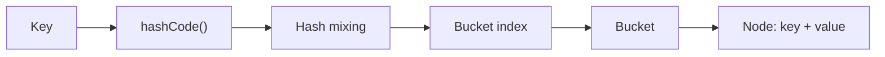
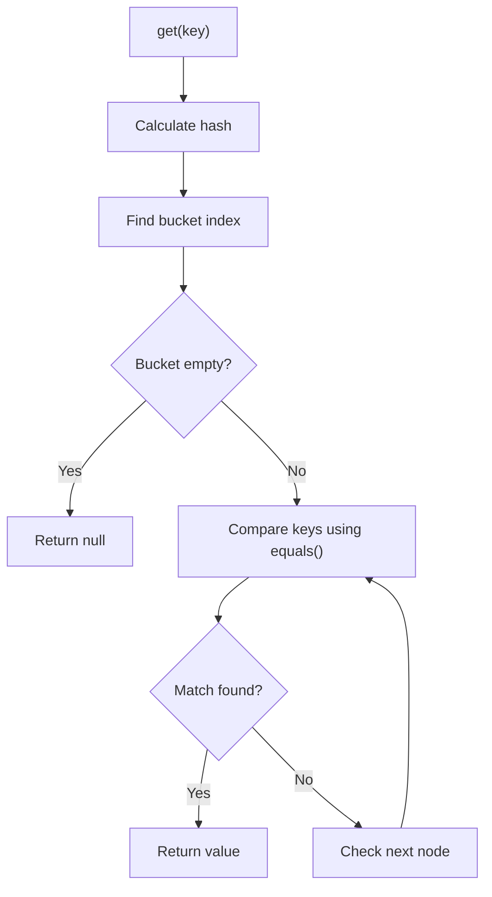
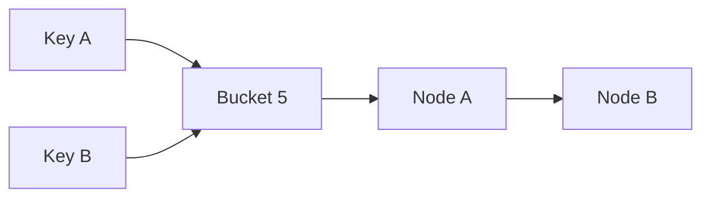
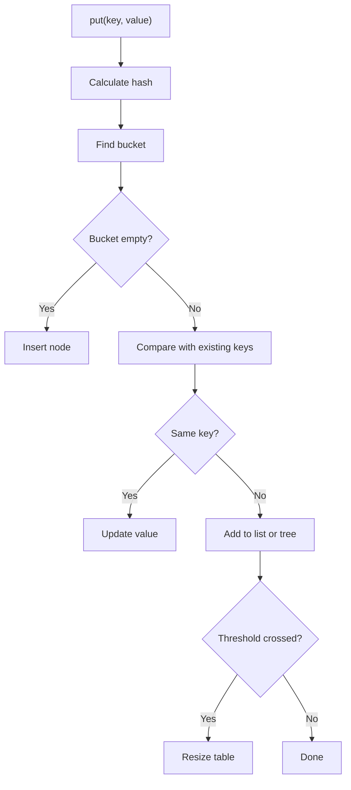

If you have written Java for more than a few days, you have probably used `HashMap`.

You call `put()`.

You call `get()`.

The value appears almost instantly.

It feels like Java has a tiny librarian inside the JVM who knows exactly where every key is stored. But the real story is even better: `HashMap` is a clever combination of arrays, hashing, equality checks, collision handling, and resizing.

In this post, we will open the hood and see how `HashMap` actually works, without turning it into a scary data structures lecture.

---

## What Is a HashMap?

A `HashMap` stores data as key-value pairs.

Think of it like a locker room:

- The key tells Java which locker to check.
- The value is the thing stored inside that locker.
- Java tries very hard to avoid checking every locker one by one.

```java
import java.util.HashMap;
import java.util.Map;

public class Main {
    public static void main(String[] args) {
        Map<String, Integer> scores = new HashMap<>();

        scores.put("Alice", 90);
        scores.put("Bob", 85);
        scores.put("Charlie", 95);

        System.out.println(scores.get("Bob"));
    }
}
```

```text
85
```

That lookup feels simple from the outside. Internally, a lot happens in a very short time.

---

## The Big Picture

At a high level, this is what happens when you put a key-value pair into a `HashMap`:



The most important idea is this:

> A `HashMap` is backed by an internal array. Each position in that array is called a bucket.

Java uses the key's hash code to decide which bucket should contain the key-value pair.

---

## The Internal Structure

Imagine a simplified `HashMap` like this:

```text
HashMap
 └── table[]
      ├── bucket 0
      ├── bucket 1 -> Node(key, value)
      ├── bucket 2
      └── bucket 3 -> Node(key, value) -> Node(key, value)
```

Each stored item is represented internally as a node. A simplified version looks like this:

```java
class Node<K, V> {
    final int hash;
    final K key;
    V value;
    Node<K, V> next;
}
```

Each node stores:

- The final hash value.
- The key.
- The value.
- A reference to the next node if multiple keys land in the same bucket.

That last field, `next`, is important. It is how `HashMap` handles collisions. We will get there soon.

---

## How put() Works

Suppose we write this:

```java
Map<String, String> map = new HashMap<>();

map.put("name", "Alice");
map.put("city", "Delhi");
```

For each `put()`, Java roughly does this:

1. Calculate the hash using the key's `hashCode()`.
2. Convert that hash into a bucket index.
3. Check the bucket.
4. If the bucket is empty, insert a new node.
5. If the bucket already has nodes, compare keys using `equals()`.
6. If the key already exists, update the value.
7. If the key does not exist, attach a new node.

Here is the idea in slow motion:

```java
map.put("name", "Alice");
```

```text
key: "name"
hashCode: some integer
bucket index: maybe 7
action: store Node("name", "Alice") in bucket 7
```

Now this:

```java
map.put("name", "Aakil");
```

does not create a second `name` entry. It finds the existing key and updates the value.

```java
System.out.println(map.get("name"));
```

```text
Aakil
```

---

## How get() Works

Now let us retrieve a value:

```java
String value = map.get("name");
```

Internally, Java follows the same route:



The magic is not that Java scans faster. The magic is that Java usually does not scan much at all.

Instead of checking every entry, it jumps to the expected bucket.

---

## Why hashCode() and equals() Matter

This is where many `HashMap` bugs are born.

Let us create a `Student` class:

```java
import java.util.HashMap;
import java.util.Map;

class Student {
    private int id;
    private String name;

    Student(int id, String name) {
        this.id = id;
        this.name = name;
    }
}

public class Main {
    public static void main(String[] args) {
        Map<Student, String> courses = new HashMap<>();

        courses.put(new Student(1, "Alice"), "Java");

        System.out.println(courses.get(new Student(1, "Alice")));
    }
}
```

```text
null
```

That feels wrong. Both students have the same `id` and `name`, right?

To us, yes.

To Java, no.

Unless we override `equals()` and `hashCode()`, Java treats those two objects as different keys.

Here is the fixed version:

```java
import java.util.Objects;

class Student {
    private int id;
    private String name;

    Student(int id, String name) {
        this.id = id;
        this.name = name;
    }

    @Override
    public boolean equals(Object o) {
        if (this == o) return true;
        if (!(o instanceof Student student)) return false;
        return id == student.id && Objects.equals(name, student.name);
    }

    @Override
    public int hashCode() {
        return Objects.hash(id, name);
    }
}
```

Now two `Student` objects with the same `id` and `name` are treated as the same key.

The golden rule:

> If two objects are equal according to `equals()`, they must return the same `hashCode()`.

---

## What Is a Collision?

A collision happens when two different keys land in the same bucket.

That sounds bad, but it is normal. A `HashMap` has a limited number of buckets, but your program can have many keys.



When a collision happens, Java stores multiple nodes in the same bucket.

Older Java versions used linked lists for this. Modern Java still starts with linked lists, but if too many nodes collect in one bucket, the bucket can become a balanced tree.

That prevents one overloaded bucket from becoming painfully slow.

---

## Linked List vs Tree Inside a Bucket

Since Java 8, a bucket can change its internal structure when collisions become heavy.

| Bucket content | Structure used |
|---|---|
| Few entries | Linked list |
| Many entries | Red-black tree |
| After resize or shrink | May become linked list again |

Some useful thresholds:

| Concept | Typical value |
|---|---:|
| Treeify threshold | 8 nodes in one bucket |
| Untreeify threshold | 6 nodes |
| Minimum table capacity for treeification | 64 |

Do not memorize these numbers as interview poetry. Understand the reason: if a bucket gets crowded, Java switches from a simple list to a tree so lookup stays efficient.

---

## Resizing and Load Factor

A `HashMap` does not wait until every bucket is full.

It resizes when the number of entries crosses a threshold.

```text
threshold = capacity x load factor
```

Default values:

| Setting | Default |
|---|---:|
| Initial capacity | 16 |
| Load factor | 0.75 |
| Resize threshold | 12 |

So with the defaults, when the 13th entry is added, the internal array grows from 16 buckets to 32 buckets.

That growth is useful, but not free. Entries need to be redistributed across the new bucket array.

If you already know the approximate size, you can provide an initial capacity:

```java
Map<Integer, String> users = new HashMap<>(128);
```

This can reduce unnecessary resizing when you are loading many entries.

---

## Why HashMap Is Usually O(1)

`HashMap` is fast because it avoids a full scan.

Instead of doing this:

```text
Check entry 1
Check entry 2
Check entry 3
Check entry 4
...
```

it usually does this:

```text
Calculate bucket index
Jump to bucket
Compare one or a few keys
Return value
```

That gives us this practical complexity table:

| Operation | Average case | Worst case |
|---|---:|---:|
| `put()` | O(1) | O(log n) or O(n) |
| `get()` | O(1) | O(log n) or O(n) |
| `remove()` | O(1) | O(log n) or O(n) |

The worst case depends on whether a crowded bucket is handled as a tree or a linked list.

---

## Common Mistakes

Let us look at the mistakes that make `HashMap` look broken even when it is doing exactly what we asked.

### 1. Using Mutable Keys

This is dangerous:

```java
import java.util.ArrayList;
import java.util.HashMap;
import java.util.List;
import java.util.Map;

public class Main {
    public static void main(String[] args) {
        Map<List<String>, String> map = new HashMap<>();

        List<String> key = new ArrayList<>();
        key.add("java");

        map.put(key, "language");

        key.add("spring");

        System.out.println(map.get(key));
    }
}
```

```text
null
```

The key changed after insertion. Its hash changed too. Now the `HashMap` may look in the wrong bucket.

Prefer immutable keys like `String`, `Integer`, records, or classes whose equality fields do not change.

### 2. Overriding equals() Without hashCode()

If you override only `equals()`, two objects may be logically equal but still produce different hash codes.

That breaks the `HashMap` contract.

Always override both together.

### 3. Expecting Insertion Order

`HashMap` does not promise insertion order.

```java
Map<String, Integer> map = new HashMap<>();

map.put("first", 1);
map.put("second", 2);
map.put("third", 3);

System.out.println(map);
```

The output order is not something your code should rely on.

If order matters, use `LinkedHashMap`.

---

## HashMap vs LinkedHashMap vs TreeMap

| Map type | Ordering | Average lookup | Use when |
|---|---|---:|---|
| `HashMap` | No guaranteed order | O(1) | You want fast general-purpose lookup |
| `LinkedHashMap` | Insertion or access order | O(1) | You need predictable iteration order |
| `TreeMap` | Sorted by key | O(log n) | You need keys in sorted order |

Most of the time, `HashMap` is the default choice. Move to the others only when ordering matters.

---

## What About ConcurrentHashMap?

`HashMap` is not thread-safe.

If multiple threads read and write the same `HashMap` at the same time, you can get confusing bugs: missing values, stale reads, or corrupted internal state.

For shared maps in multithreaded code, Java gives us `ConcurrentHashMap`:

```java
import java.util.Map;
import java.util.concurrent.ConcurrentHashMap;

public class Main {
    public static void main(String[] args) {
        Map<String, Integer> visits = new ConcurrentHashMap<>();

        visits.put("home", 1);
        visits.merge("home", 1, Integer::sum);

        System.out.println(visits.get("home"));
    }
}
```

```text
2
```

The simple idea:

- `HashMap` is great for single-threaded or externally synchronized code.
- `ConcurrentHashMap` is designed for safe concurrent access.
- Reads usually do not block.
- Updates lock only small parts of the map instead of locking the whole map.
- It does not allow `null` keys or `null` values, which helps avoid ambiguity in concurrent reads.

Use `ConcurrentHashMap` when many threads need to share and update the same map.

---

## Putting It All Together

Here is the full `put()` journey:



And here is the short version:

1. `hashCode()` decides the neighborhood.
2. The bucket index decides the exact bucket.
3. `equals()` confirms the exact key.
4. Collisions are handled using lists or trees.
5. Resizing keeps buckets from getting too crowded.

---

## Final Thoughts

`HashMap` feels magical because its API is tiny:

```java
map.put(key, value);
map.get(key);
map.remove(key);
```

But under the hood, it is a very practical machine.

It uses an array for direct access, hashing to choose a bucket, `equals()` to confirm keys, linked lists or trees to handle collisions, and resizing to keep performance healthy.

If you remember only one thing, remember this:

> Good `HashMap` performance depends on good keys.

Use stable keys. Implement `equals()` and `hashCode()` correctly. Do not depend on ordering. Then let `HashMap` do what it does best: fast lookups with a clean API.
